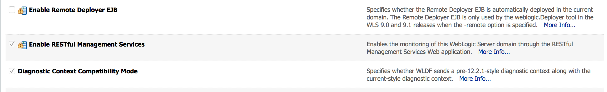
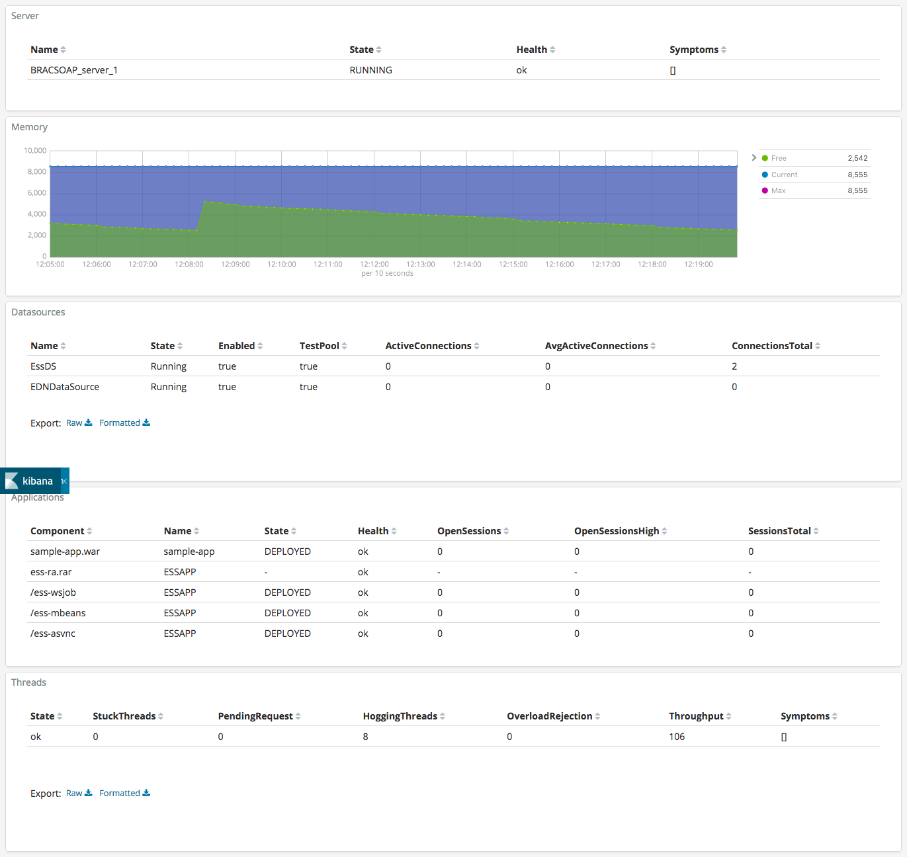

# Weblogicbeat

Weblogic monitoring tool for ELK (elasticsearch, logstash, kibana).

This is a custom metricbeat that monitor weblogic domains. Capture information about:

- Server state and health
- Memory use
- Threads status
- Datasource health and statistics
- Applications health and statistics

*Tested with version 6.3.2 of elasticsearch and kibana*

## Configuration

### Enable RESTful Management Services

1. Under Domain structure, click on the domain name
2. Under Configuration > General, expand the Advanced section
3. Select the check box RESTful Management Services and click Save.



### Download Release

### Run

To run Weblogicbeat with debugging output enabled, run:

```
./weblogicbeat -c weblogicbeat.yml
```

### Kibana

Install

./kibana-plugin install https://github.com/fbaligand/kibana-enhanced-table/releases/download/v0.7.1/enhanced-table-0.7.1_6.3.2.zip

It includes a set of visualizations and one dashboard for weblogic monitoring. Import the file [kibana-weblogic-dashboard-export.json](kibana-weblogic-dashboard-export.json)



### Weblogicbeat configuration

Sample configuration file

```
weblogicbeat:
  period: 60s
  host: http://localhost:7001
  username: weblogic
  password: welcome1
  servername: server1
  datasources: ["EssDS", "EDNDataSource"]
  applications: ["ESSAPP", "sample-app"]
```
- period: How often an event is sent to the output
- host: Admin host and port
- username: Weblogic admin user
- password: Weblogic admin password
- datasources: Array of datasources to monitor
- applications: Array of applications to monitor

## Compilation

### Configure golang

- Install [Golang](https://golang.org/dl/) 1.7
- Create a directory for go and create the env variable "GOPATH"

```
GOPATH=~/go
mkdir -p $GOPATH
echo "export GOPATH=${GOPATH}" >> ~/.bash_profile
```

### Install dependencies

```
go get github.com/elastic/beats
go get github.com/Jeffail/gabs
go get gopkg.in/resty.v1
go get golang.org/x/net/publicsuffix
```

### Init Project
To get running with Weblogicbeat and also install the
dependencies, run the following command:

```
mage setup
```

*I had some issues on my mac with the make setup. I had to create manually a python2 env in build/python-env and install with pip the functools32 dependency. Be careful when using mage clean the build directory is erased and the python-env directory needs to be created again*


### Build

To build the binary for Weblogicbeat run the command below. This will generate a binary
in the same directory with the name weblogicbeat.

```
mage build
```

## Packaging

The beat frameworks provides tools to crosscompile and package your beat for different platforms. This requires [docker](https://www.docker.com/) and vendoring as described above. To build packages of your beat, run the following command:

```
mage package
```

This will fetch and create all images required for the build process. The whole process to finish can take several minutes.


## References

- Using WebLogic 12C RESTful management for monitoring WebLogic Domains
https://blog.dbi-services.com/using-weblogic-12c-restful-management-for-monitoring-weblogic-domains/

- Monitoring Domain Resources
https://docs.oracle.com/middleware/1221/wls/WLRUR/examples.htm#WLRUR203

- Weblogic monitoring exporter
https://github.com/oracle/weblogic-monitoring-exporter

- Jolokia
https://jolokia.org/
